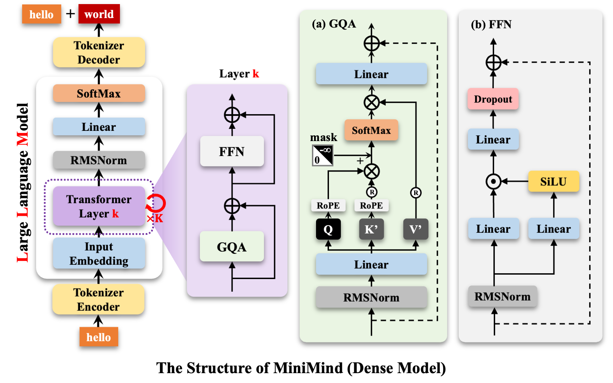

## 我的提問
從這兩張圖可看出，兩者主要差異源於 Transformer 的 k 層中先經過 GQA 處理後才分支為 FNN(Feedforward Neural Network，前饋神經網絡) 或 MoE(Mixed of Experts) 流程，FNN 主要負責將注意力層的輸出進行進一步的特徵轉換，增強模型的表達能力，並通過殘差連接促進更好的訓練效果，而 `MoE` 也是增加模型表達能力的功能嗎？ 

`MoE`（混合專家系統）確實是增加模型表達能力的功能，但與標準的 FFN 相比有顯著不同：

### MoE 與 FFN 的共同點
- 兩者都位於注意力層之後
- 兩者都負責進行特徵轉換
- 兩者都通過殘差連接與前層結合

### MoE 的獨特優勢與運作方式
1. **動態專家選擇**：
   - 不同於 FFN 對所有輸入使用相同參數
   - MoE 通過 Router（路由器）動態選擇最適合特定輸入的 Top-k 專家

2. **模型容量與計算效率分離**：
   - 從圖中可見，MoE 分為「共享專家」(Shared Experts) 和「路由專家」(Routed Experts)
   - 可以大幅增加模型參數量（Y+X 個專家）而不比例增加計算量（僅使用 Top-k 個專家）

3. **條件性計算**：
   - FFN 對所有 token 使用相同的計算路徑
   - MoE 對不同 token 激活不同的專家，實現計算資源的動態分配

4. **專家特化**：
   - 不同專家可以專門處理不同類型的輸入或任務
   - 增加了模型處理多樣化語言現象的能力

5. **擴展性更強**：
   - 可以輕鬆擴展到有數百個專家的超大模型
   - 右圖中的 M = X + Y 表示總專家數，但每個 token 只使用其中很少一部分

總結來說，MoE 與 FFN 都服務於增強模型表達能力的目標，但 MoE 通過條件計算和動態路由提供了更高的參數效率和潛在的更強表達能力。這是為什麼在超大規模語言模型（如 Google 的 Switch Transformer、Mixtral 8x7B 等）中採用 MoE 架構的主要原因。


## MoE中「專家」的實質意義以及Router的對應類別。

1. **MoE中「專家」的實質意義：**
在MoE (Mixture of Experts)中，「專家」不是指多套完整的LLM，而是指模型中的特定神經網絡組件，通常是實現為前饋網絡(Feed-Forward Network)。從代碼可以看出，專家實際上是FFN的實例。

2. **Router對應的類別：**
從代碼中，可以看到:
- `MoEGate` 類負責計算專家選擇的分數和權重，它是實現路由功能的主要組件
- `MOEFeedForward` 類使用`MoEGate`來選擇專家，然後調用選中的專家

所以Router對應的是`MoEGate` .model.py(L224-L279)類，它實現了選擇哪些專家處理當前token的功能。

### MoE 中「專家」的實質意義

在 MoE (Mixture of Experts) 架構中，「專家」指的不是多套完整的 LLM，而是指**特定神經網絡子模組**，具體來說：

1. **專家本質**：每個專家實際上是一個完整的前饋網絡 (FFN) 模組，具有相同的結構但不同的參數
   ```python
   # 在 MOEFeedForward 類中定義的專家
   self.experts = nn.ModuleList([
       FeedForward(config)  # 每個專家就是一個標準的 FeedForward 模組
       for _ in range(config.n_routed_experts)
   ])
   ```

2. **專門化功能**：每個專家通過訓練，逐漸專門化處理特定類型的輸入或語言模式
   - 例如某些專家可能擅長處理數學內容
   - 另一些專家可能擅長處理語法結構
   - 還有專家可能專門針對特定領域知識

3. **替代關係**：MoE 中的專家 **替代** 了傳統 Transformer 層中的單一 FFN 模組，而不是替代整個 LLM

### Router 對應的類別

Router（路由器）對應的是 `model.py` 中的 `MoEGate` 類：

而 `MOEFeedForward` .model.py(L282-L339) 類則是整個 MoE 層的實現，它:
1. 包含了 `MoEGate`（Router）作為成員
2. 包含了多個 `FeedForward` 專家
3. 基於 Router 的決策來分發輸入到選定的專家

總結來說，MoE 中的專家是前饋網絡的實例，而不是完整的語言模型；Router 對應的是 `MoEGate` 類，它負責決定每個 token 應該由哪些專家處理。
