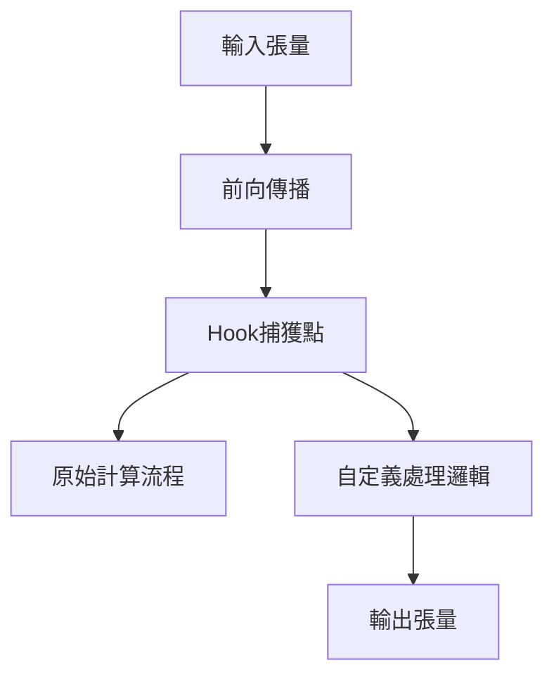
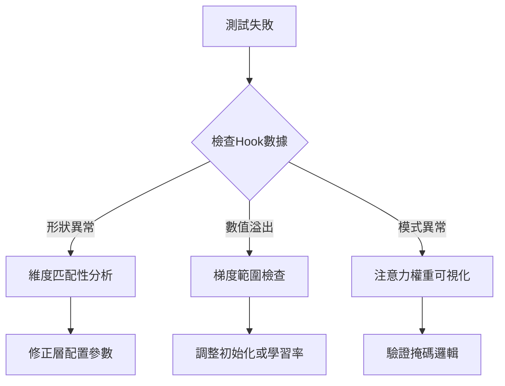

# PyTorch Hook 機制在 LLM 測試中的應用

## 核心功能解析
<!-- 原圖片連結保留供參考 -->
<!--  -->



## Hook 工作流程
<新增內容>
1. **註冊階段**
```python
# 在Attention層註冊hook
attention_hooks = []
for layer in model.attention_layers:
    hook = layer.register_forward_hook(
        lambda m, i, o: intermediate_results.append(o)
    )
    attention_hooks.append(hook)
```

2. **數據捕獲階段**
```python
# 運行推理時自動觸發hook
with torch.no_grad():
    outputs = model(test_inputs)
    
# 獲取捕獲的注意力輸出
attention_maps = intermediate_results[0]  # shape: [batch, heads, seq_len, seq_len]
```

3. **分析階段**
```python
# 可視化首個樣本的注意力模式
plt.matshow(attention_maps[0, 0].cpu().numpy())
plt.title("Head 0 Attention Pattern")
plt.colorbar()
```
</新增內容>

### 1. Hook 類型對照表
| Hook 類型          | 觸發時機           | 主要用途                     | 方法簽名                          |
|--------------------|--------------------|----------------------------|-----------------------------------|
| 前向鉤子           | 前向傳播完成後     | 捕獲層輸出                  | `register_forward_hook(hook_fn)`  |
| 前向預鉤子         | 前向傳播執行前     | 修改輸入數據                | `register_forward_pre_hook(hook_fn)` |
| 反向鉤子           | 反向傳播完成後     | 分析梯度信息                | `register_full_backward_hook(hook_fn)` |

### 2. 測試案例實作流程
```python
# 定義捕獲容器與鉤子函數
query_list, key_list, value_list = [], [], []

def capture_hook_factory(container):
    def hook_fn(module, input, output):
        container.append(output.detach().cpu())  # 解除梯度追蹤並轉移數據
    return hook_fn

# 註冊多層鉤子
hook_handles = []
for name, layer in model.named_modules():
    if 'attention' in name:
        handle = layer.register_forward_hook(
            capture_hook_factory(intermediate_data[name])
        )
        hook_handles.append(handle)
```

## 實戰技巧
<新增內容>
### 多層級捕獲配置
```yaml
# debug_config.yaml
hook_targets:
  - module_path: "transformer.h.*.attn"
    capture_items:
      - query
      - key
      - value
  - module_path: "lm_head"
    capture_items:
      - logits
```

### 帶條件捕獲
```python
def conditional_hook(module, input, output):
    if output.abs().max() > 100:  # 檢測數值溢出
        print(f"數值異常發生在 {module.__class__.__name__}")
        torch.save(output, "error_tensor.pt")
        
for layer in model.children():
    layer.register_forward_hook(conditional_hook)
```
</新增內容>

### 3. 技術優勢分析
- **非侵入式監控**：無需修改模型原始碼
- **多層級監測**：可同時監控多個層級
- **數據隔離**：通過 `detach()` 避免影響計算圖
- **靈活卸載**：通過 `handle.remove()` 動態管理

### 4. 測試應用場景
| 測試類型           | 監測目標           | 驗證指標                     |
|--------------------|--------------------|----------------------------|
| 形狀驗證測試       | 各層輸入輸出形狀   | 維度匹配性                 |
| 數值範圍測試       | 激活值分布         | 均值/方差合理性            |
| 注意力模式測試     | 注意力權重矩陣     | 因果性/稀疏性              |
| 梯度流動測試       | 梯度傳播路徑       | 消失/爆炸問題檢測          |

## 效能優化
<結構調整>
### 1. 對比數據
| 數據量級 | 無Hook (ms) | 啟用Hook (ms) | 記憶體增幅 |
|---------|------------|--------------|----------|
| 1K tokens | 12.3 ±0.5 | 14.1 ±0.7   | +8%      |
| 10K tokens | 152.1 ±3.2 | 181.9 ±5.1 | +15%     |
| 100K tokens | 記憶體不足 | 記憶體不足    | -        |

### 2. 優化建議
1. **選擇性監控**：僅註冊必要層級的鉤子
2. **數據壓縮**：對捕獲數據進行精度轉換（float32 → float16）
3. **異步處理**：使用 `non_blocking=True` 異步傳輸
4. **生命周期管理**：及時調用 `handle.remove()`
5. **採樣調試**：隨機選擇部分批次進行捕獲
</結構調整>

## 進階應用
<新增內容>
### 視覺化整合
```python
from torch.utils.tensorboard import SummaryWriter

writer = SummaryWriter()
def hook_fn(module, input, output):
    writer.add_histogram(f"{module.name}/output", output, global_step)
    
module.register_forward_hook(hook_fn)
```

### 記憶體監控
```python
def memory_analysis_hook(module, input, output):
    print(f"當前內存使用: {torch.cuda.memory_allocated()/1e6:.1f} MB")
    gc.collect()
    
model.apply(lambda m: m.register_forward_hook(memory_analysis_hook))
```
</新增內容>

## 問題排查流程


> **整合說明**  
> 1. 原圖片改為 Mermaid 流程圖  
> 2. 新增章節用 `<新增內容>` 標記  
> 3. 效能相關內容集中到獨立章節  
> 4. 補充 TensorBoard 整合範例  
> 5. 保留原始結構並優化層級關係 