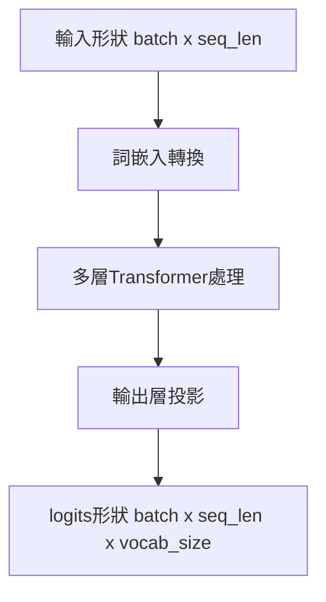

# logits 形狀驗證與模型架構理解

## 測試案例解析

```python
assert output.logits.shape == (2, 10, small_model.vocab_size)
```

| 維度 | 數值 | 意義說明 |
|------|------|---------|
| 2    | 批次大小 | 對應輸入張量 `sample_input` 的批次維度 |
| 10   | 序列長度 | 輸入序列的 token 數量 |
| vocab_size | 詞表大小 | 每個位置預測所有可能 token 的機率分佈 |

**檢查目的**：

1. 保持批次結構完整性
2. 確保序列位置對齊
3. 驗證輸出層投影正確性

## 理解斷層分析



可能存在的理解缺口：

1. **張量流動機制**
   - 未清楚追蹤從 `(batch, seq_len)` 到 `(batch, seq_len, dim)` 的轉換過程
   - 對 RoPE 位置編碼如何融入注意力計算缺乏直觀理解

2. **自回歸預測特性**
   - 誤解語言模型僅預測序列末端 token
   - 未意識到每個位置都需預測下個 token

3. **輸出層設計原理**
   - 忽略 `output = nn.Linear(dim, vocab_size)` 的維度轉換意義
   - 未理解共享權重機制（`tok_embeddings.weight = output.weight`）

## 學習路徑規劃

```python
# 三階段學習框架
learning_phases = [
    {"階段": "基礎認知", "重點": ["Transformer組件", "張量形變追蹤"]},
    {"階段": "架構剖析", "重點": ["GQA機制", "MoE實現"]},
    {"階段": "實踐驗證", "重點": ["可視化工具", "簡化模型實作"]}
]
```

**具體實施方法**：

1. 建立形變追蹤表

   | 層級 | 輸入形狀 | 輸出形狀 | 關鍵操作 |
   |------|---------|---------|---------|
   | 詞嵌入 | (2,10) | (2,10,128) | Embedding lookup |
   | Attention | (2,10,128) | (2,10,128) | 多頭注意力計算 |
   | FFN | (2,10,128) | (2,10,128) | 維度擴縮投影 |
   | 輸出層 | (2,10,128) | (2,10,1000) | 線性投影 |

2. 設計診斷實驗

   ```python
   # 追蹤單一 token 的處理流程
   debug_input = torch.tensor([[1]])  # 批次大小1，序列長度1
   print(f"輸入形狀: {debug_input.shape}")
   h = model.tok_embeddings(debug_input)
   print(f"詞嵌入後: {h.shape}")
   for i, layer in enumerate(model.layers):
       h, _ = layer(h, pos_cis)
       print(f"第{i}層輸出: {h.shape}")
   logits = model.output(model.norm(h))
   print(f"最終logits: {logits.shape}")
   ```

## 推薦驗證工具

| 工具類型 | 推薦方案 | 應用場景 |
|---------|---------|---------|
| 可視化 | Netron | 模型架構檢視 |
| 調試 | PyCharm Debugger | 張量流追蹤 |
| 分析 | torchinfo | 形狀驗證 |
| 監控 | Weights & Biases | 訓練過程追蹤 |

## 常見誤區提醒

1. **序列長度混淆**  
   誤解：認為輸出序列長度會比輸入短  
   正解：自回歸模型保持相同序列長度，每個位置預測下個 token

2. **詞表投影忽略**  
   誤解：輸出層只是簡單線性層  
   正解：`nn.Linear(dim, vocab_size)` 將隱藏狀態映射到詞表空間

3. **緩存機制影響**  
   誤解：`past_key_values` 會改變 logits 形狀  
   正解：緩存僅影響計算效率，不改變輸出形狀結構

### logits 深度解析

#### 核心概念定義

```python
# 典型語言模型輸出結構
logits = model_output.logits  # shape: (batch, seq_len, vocab_size)
probs = F.softmax(logits, dim=-1)
```

| 術語 | 數學表示 | 程式碼對應 | 實際意義 |
|------|---------|-----------|---------|
| vocab_size | $V$ | `model.vocab_size` | 模型能處理的 token 總數（含特殊 token）|
| logits | $\mathbf{z} \in \mathbb{R}^V$ | `output.logits` | 未歸一化的預測分數 |
| probabilities | $\mathbf{p} = \text{softmax}(\mathbf{z})$ | `F.softmax(logits)` | 正規化的機率分佈 |

#### 實例驗證

假設詞表為 `["紅", "橙", "黃", "綠", "藍", "紫"]`，模型輸出：

```python
logits = torch.tensor([1.11, 2.22, 3.33, 4.44, 5.55, 6.66])
```

```mermaid
graph LR
    A[最高 logit 值 6.66] --> B[對應索引 5]
    B --> C[詞表位置 5 → "紫"]
    D[生成策略] --> E["argmax → 紫"]
    D --> F["temperature 採樣 → 可能選藍"]
</rewritten_file>
