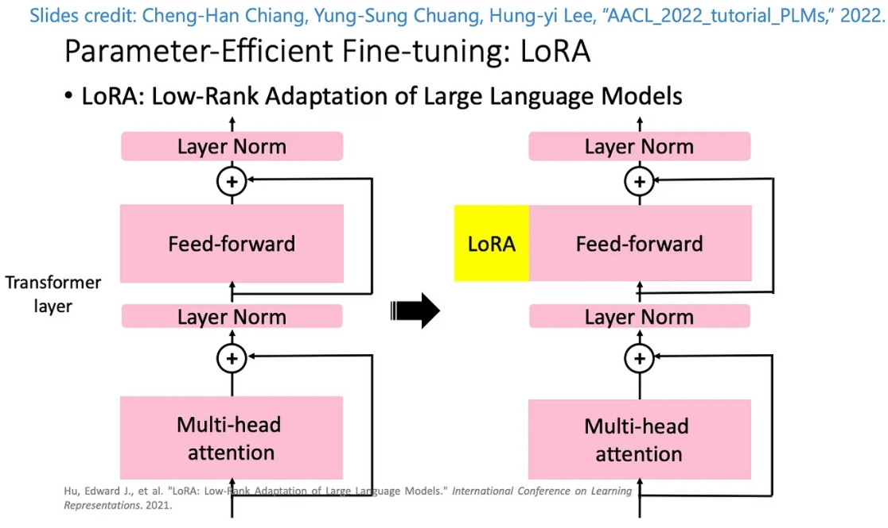

# LoRA 的工作原理



*圖片來源: [微調大型語言模型LLM的技術LoRA及生成式AI-Stable diffusion LoRA](https://xiaosean5408.medium.com/%E5%BE%AE%E8%AA%BF%E5%A4%A7%E5%9E%8B%E8%AA%9E%E8%A8%80%E6%A8%A1%E5%9E%8Bllm%E7%9A%84%E6%8A%80%E8%A1%93lora%E5%8F%8A%E7%94%9F%E6%88%90%E5%BC%8Fai-stable-diffusion-lora-61a41d636772)*

上圖展示了 LoRA 的基本原理：在原本的 Transformer 層中添加一個黃色的 LoRA 模塊，它與原有的前向傳播過程並行運行，最終的輸出是兩者的疊加。這種設計使得模型能夠在不增加過多參數的情況下，通過低秩適應來提升其性能。

## 秩（Rank）的直觀理解

秩可以理解為「訊息壓縮的程度」或「特徵表達的維度」。想像一下：

1. **資訊壓縮器**：秩就像是一個資訊壓縮器的容量。較低的秩意味著我們使用更小的"瓶頸"來傳遞資訊。

2. **特徵提取器**：秩決定了我們能夠從原始資料中提取多少個獨立特徵。例如，秩為4表示我們只保留4個最重要的特徵或模式。

### LoRA 中秩的具體作用

在 LoRA 的架構中：

```text
原始權重矩陣 W（大尺寸）≈ W₀（凍結不變）+ A × B（低秩更新）
```

其中：

- A 是一個 `輸出尺寸 × R` 的矩陣
- B 是一個 `R × 輸入尺寸` 的矩陣
- R 就是秩，遠小於輸入和輸出尺寸

### 更貼近 LoRA 理念的解釋

1. **參數效率的關鍵**：秩值決定了 LoRA 的參數效率。假設原始權重是一個 1000×1000 的矩陣（100萬個參數），使用秩為10的 LoRA，只需要 10×(1000+1000) = 20,000 個參數，僅為原始參數的2%。

2. **資訊瓶頸**：秩相當於我們設置的資訊瓶頸大小。較小的秩迫使模型學習更有效的特徵表示，但可能會限制表達能力；較大的秩提供更多自由度，但可能導致過度擬合。

3. **調整自由度**：秩值實際上是我們給予模型調整的「自由度」。較小的秩表示我們只允許模型在幾個主要方向上進行調整，這通常足以適應特定任務而不會過度改變原始模型的行為。

4. **任務適應的精細程度**：秩值可以視為微調精細程度的調節器。較小的秩值適合簡單的領域遷移任務，較大的秩值則適合更複雜的任務適應。

### 實例類比

想像一個大型語言模型就像一本詳盡的百科全書。通過 LoRA 微調，我們不是重寫整本百科全書，而是添加一套小型的"勘誤表"來適應特定領域。秩值決定了這個勘誤表的複雜程度：

- 低秩：只修正幾個關鍵概念（簡單但高效）
- 高秩：提供更詳細的修正（更強大但需要更多資源）

這種解釋更符合 LoRA 的核心理念：通過少量但關鍵的參數更新來有效適應新任務，而不是大規模地改變原始模型。

## LoRA如何避免循環參照

疊加原模型的nn.Linear層在這段代碼中，使用 `forward_with_lora` 內部函數來疊加 `module.forward` 的設計確實是為了避免循環引用的問題。讓我們深入分析這個過程。

### 循環引用的問題

如果直接將 `module.forward` 設置為 `forward_with_lora`，而在 `forward_with_lora` 中又調用 `module.forward`，這將導致無限遞歸。因為每次調用 `module.forward` 都會進入 `forward_with_lora`，然後再次調用 `module.forward`，形成一個循環。

### 如何避免循環引用

1. **保存原始的 `forward` 方法**：
   - 在 `apply_lora` 函式中，首先將原始的 `module.forward` 方法保存到 `original_forward` 變量中。這樣，`original_forward` 變量就持有了原始的前向傳播邏輯。

   ```python
   original_forward = module.forward
   ```

2. **定義新的前向傳播函數**：
   - 在 `forward_with_lora` 函數中，使用 `layer1=original_forward` 和 `layer2=lora` 來顯式地綁定原始的前向傳播方法。這樣，當 `forward_with_lora` 被調用時，它會使用 `original_forward` 而不是 `module.forward`。

   ```python
   def forward_with_lora(x, layer1=original_forward, layer2=lora):
       return layer1(x) + layer2(x)
   ```

3. **覆蓋 `module.forward`**：
   - 最後，將 `module.forward` 設置為 `forward_with_lora`。這樣，當調用 `module.forward` 時，實際上會執行 `forward_with_lora`，而 `forward_with_lora` 內部調用的是 `original_forward`，從而避免了循環引用。

   ```python
   module.forward = forward_with_lora
   ```

### Python 解譯器的安排

在 Python 中，當你定義一個函數時，該函數的作用域會捕獲當前上下文中的變量。這意味著：

- `forward_with_lora` 函數在定義時捕獲了 `original_forward` 的當前值（即原始的 `module.forward` 方法）。
- 當 `forward_with_lora` 被調用時，它使用的是捕獲的 `original_forward`，而不是當前的 `module.forward`。

這樣的設計確保了在新的 `module.forward` 被調用時，實際上是調用的原始前向傳播邏輯，而不是新的 `forward_with_lora`，從而避免了無限遞歸的問題。

### 總結

通過將原始的 `module.forward` 方法保存到 `original_forward`，並在新的前向傳播函數中使用這個保存的引用，Python 解譯器能夠正確地安排函數調用，避免了循環引用的問題。這種設計模式在許多需要擴展或裝飾現有功能的情況下都非常有用。

## MiniMindLM運用於LoRA時的過程解釋

您的理解是正確的！讓我詳細解釋 `apply_lora` 在 `MiniMindLM` 模型中的作用。

### 1. 選擇性應用 LoRA

```python
def apply_lora(model, rank=16):
    for name, module in model.named_modules():
        if isinstance(module, nn.Linear) and module.weight.shape[0] == module.weight.shape[1]:
            # 只在符合條件的線性層上應用 LoRA
```

在 `MiniMindLM` 中，確實只有符合以下條件的層才會被應用 LoRA：

1. 必須是 `nn.Linear` 的實例
2. 輸入維度等於輸出維度（方陣條件：`module.weight.shape[0] == module.weight.shape[1]`）

### 2. MiniMindLM 中的層級結構

讓我們看看 `MiniMindLM` 中的各種層：

```python
class MiniMindLM(PreTrainedModel):
    def __init__(self, params):
        # 不會應用 LoRA（非方陣）
        self.tok_embeddings = nn.Embedding(params.vocab_size, params.dim)
        
        # 不會應用 LoRA（非線性層）
        self.dropout = nn.Dropout(params.dropout)
        
        # 內部包含線性層的區塊
        self.layers = nn.ModuleList([MiniMindBlock(l, params) for l in range(self.n_layers)])
        
        # 不會應用 LoRA（非線性層）
        self.norm = RMSNorm(params.dim, eps=params.norm_eps)
        
        # 不會應用 LoRA（非方陣，因為 vocab_size != dim）
        self.output = nn.Linear(params.dim, params.vocab_size, bias=False)
```

### 3. 會應用 LoRA 的具體位置

在 `MiniMindBlock` 中：

```python
class MiniMindBlock(nn.Module):
    def __init__(self, layer_id, config):
        # Attention 中的線性層
        self.attention = Attention(config)
        
        # 不會應用 LoRA（非線性層）
        self.attention_norm = RMSNorm(config.dim, eps=config.norm_eps)
        self.ffn_norm = RMSNorm(config.dim, eps=config.norm_eps)
        
        # FeedForward 中的線性層
        self.feed_forward = FeedForward(config)
```

具體來說，LoRA 會應用在：

1. **Attention 模組中的線性層**：

    ```python
    class Attention(nn.Module):
        def __init__(self, args):
            # 這些線性層中，如果輸入輸出維度相同，就會應用 LoRA
            self.wq = nn.Linear(args.dim, args.n_heads * self.head_dim, bias=False)
            self.wk = nn.Linear(args.dim, self.n_kv_heads * self.head_dim, bias=False)
            self.wv = nn.Linear(args.dim, self.n_kv_heads * self.head_dim, bias=False)
            self.wo = nn.Linear(args.n_heads * self.head_dim, args.dim, bias=False)
    ```

2. **FeedForward 模組中的線性層**：

    ```python
    class FeedForward(nn.Module):
        def __init__(self, config):
            # 這些線性層中，如果輸入輸出維度相同，就會應用 LoRA
            self.w1 = nn.Linear(config.dim, config.hidden_dim, bias=False)
            self.w2 = nn.Linear(config.hidden_dim, config.dim, bias=False)
            self.w3 = nn.Linear(config.dim, config.hidden_dim, bias=False)
    ```

### 4. 為什麼這樣設計？

1. **效率考量**：

    - 只在關鍵的線性轉換層應用 LoRA，可以在保持模型適應能力的同時，最小化額外參數的數量。
    - 方陣條件確保了 LoRA 的低秩分解是有意義的。

2. **架構特點**：

    - 注意力機制和前饋網絡中的線性層是模型中最重要的參數，它們主導了模型的學習能力。
    - 其他層（如 RMSNorm、Dropout）主要用於正則化和穩定訓練，不需要 LoRA 調整。

所以您的理解是完全正確的！LoRA 確實是選擇性地只應用在特定的線性層上，這種設計既保證了效率，又維持了模型的適應能力。
